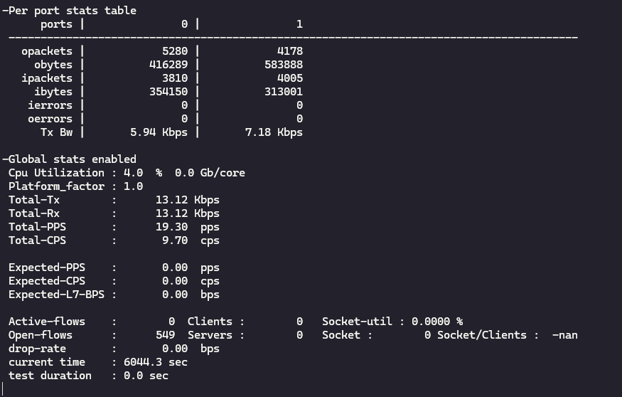
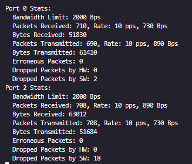

# DPDK-based Packet Processing Application

## Overview

This application is a high-performance network packet processing tool built using DPDK (Data Plane Development Kit). It is designed to process packets efficiently by leveraging DPDK's fast packet I/O capabilities. The application supports traffic filtering, bandwidth control, and real-time statistics logging.

## Features

- High-speed packet capture and processing using DPDK.
- Support for up to two network ports.
- Bandwidth control to limit traffic flow.
- Filtering of packets based on a configurable list of IP addresses.
- Real-time logging of packet rates and statistics.

## Prerequisites

Ensure your system meets the following prerequisites:

- A Linux-based operating system (e.g., Ubuntu, CentOS).
- GCC (G++) compiler.
- CMake build system.
- DPDK installed and configured correctly.
- Root (sudo) privileges for running DPDK applications.
- NICs that support DPDK (e.g., Intel ixgbe, i40e, or Mellanox).

## Installation

### 1. Install Dependencies

```sh
sudo apt update && sudo apt install -y build-essential cmake libnuma-dev
```

### 2. Install and Configure DPDK

Refer to the [DPDK documentation](https://doc.dpdk.org/guides/linux_gsg/index.html) for detailed instructions.

```sh
sudo apt install -y dpdk dpdk-dev
```

Configure hugepages:

```sh
echo 1024 | sudo tee /sys/kernel/mm/hugepages/hugepages-2048kB/nr_hugepages
```

### 3. Clone the Repository

```sh
git clone https://github.com/mqasimfarooqi/Projects.git
cd Projects/DpdkApplication
```

### 4. Build the Application

```sh
mkdir build && cd build
cmake ..
make -j$(nproc)
```

## Usage

### Command-line Options

```
Usage: ./DpdkApp [OPTIONS]
  -h, --help                Show usage information.
  -L, --list                List available network devices.
  -d, --device-list <ids>   Specify network device IDs (comma-separated).
  -a, --address-list <ips>  Specify IPs to drop (comma-separated).
  -b, --bandwidth <bps>     Set bandwidth limit in bits per second.
  -c, --core-mask <mask>    Specify core mask for DPDK threads.
```

### Running the Application

```sh
sudo ./DpdkApp -d 0,1 -a 192.168.1.1,192.168.1.2 -b 100000000 -c 0x3
```

## Logs and Statistics

- Logs are saved in `DpdkApp.log`.
- Real-time statistics are printed periodically.

## Troubleshooting

- Ensure that your NIC supports DPDK and is bound to the correct driver.
- Check hugepage allocation with `cat /proc/meminfo | grep HugePages`.
- Use `dpdk-devbind.py --status` to verify network interfaces.

## Testing

The application has been extensively tested using the Cisco TRex traffic generator to simulate various network traffic scenarios. Test cases include:

- **Performance Testing**: Performance testing has not been done on the application due to hardware limitations.
- **Filtering Tests**: Verifying correct packet filtering based on IP addresses.
- **Bandwidth Control Tests**: Ensuring accurate bandwidth limitation.
- **Fine Tuning**: This application has not been fine tuned due to hardware limitations.

By utilizing TRex, we can generate precise traffic patterns and analyze the application's behavior in different scenarios.


